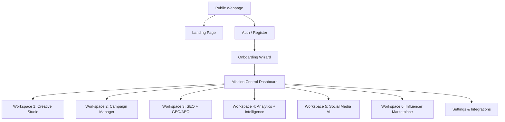
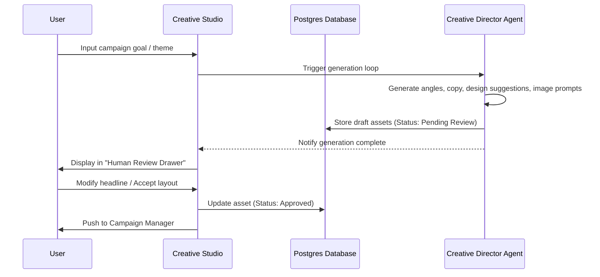
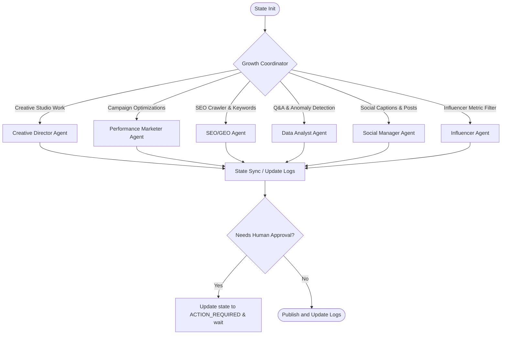

# Raftra AI - Implementation Plan & System Architecture

Raftra AI is a premium AI Growth Operating System designed to replace fragmented marketing tools with a unified, multi-agent AI marketing team. This document details the complete product information architecture, user flows, dashboard layouts, design system, component definitions, and technical architecture (including API, Database Schema, and LangGraph Agent design).

---

## User Review Required

> [!IMPORTANT]
> **Core Architecture Decisions:**
> 1. We propose a monorepo setup using **Next.js (App Router, TypeScript, TailwindCSS/Vanilla CSS modules)** and **Prisma ORM** connecting to **PostgreSQL**.
> 2. We use a **LangGraph-inspired state machine orchestration layer** built on Node.js/Edge handlers, utilizing Server-Sent Events (SSE) to stream agent updates, logs, and messaging.
> 3. Integrations (Meta, Google Ads) will require Sandbox API credentials for demo testing. Please review the OAuth callback flows below.

---

## 1. Product Information Architecture

The information architecture is split into the **Public Marketing Experience** and the **Growth Operating System (Post-Login Dashboard)**.



### Pages and Subsections:
1. **Public Landing Page**
   - **Hero**: Core value proposition, "Start Free" / "Book Demo" CTAs, Live agent terminal preview.
   - **The Problem**: Side-by-side comparison of 20+ disconnected tools vs unified AI growth ops.
   - **The Solution**: Introduction to Raftra AI (automated agent operations, creative generator, campaign manager).
2. **Onboarding Wizard**
   - Step 1: Business Details & Brand URL.
   - Step 2: Platform Connections (Sandbox Meta/Google Ads toggles).
   - Step 3: Brand Tone & Voice Selection.
   - Step 4: AI Agent Initiation & Scraping (Loading state with real-time feedback).
3. **Mission Control (Dashboard)**
   - Dashboard core displaying: active agents, what needs attention, opportunities feed, Unified Claude analytics bar.
4. **Workspaces (WS1 - WS6)**
   - Specialized panels containing setup dashboards, asset previews, reviews, and configuration parameters.

---

## 2. User Flows

### Flow A: Brand Onboarding & Scraping
1. User enters company URL (e.g. `https://example.com`) and uploads brand assets (logo, font, colors, docs).
2. UI displays a glowing agent terminal showing the **Creative Director Agent** scraping, extracting brand colors, detecting typography, studying competitors, and saving assets in the DB.
3. User completes onboarding and enters the **Mission Control Dashboard** pre-populated with initial AI insights.

### Flow B: Creative Generation & Review


### Flow C: Campaign Optimization
1. **Analytics Agent** detects a fatiguing ad creative (CPA increased by 23%, CTR dropped 15%).
2. Alert is pushed to **Mission Control**: *"Creative fatigue detected on Google Search. Deploy variant B?"*
3. User clicks the alert, triggering a slider panel displaying:
   - Performance decline details.
   - Recommended replacement creative (generated by Creative Studio).
4. User clicks **"Deploy Immediately"**. Campaign Manager pushes updates to the mock/sandbox Ad APIs and updates dashboard metrics.

---

## 3. Dashboard Layout

The workspace dashboard is designed as a unified premium control center.

```
+---------------------------------------------------------------------------------------+
|  Raftra AI  |  [Search anything...]                    [Agent Status: 3 Running] (O) |
+-------------+-------------------------------------------------------------------------+
| (MC) Control|  Welcome back, Growth Leader                                            |
|             |  +-------------------------------------+  +---------------------------+ |
| (WS1) Studio|  | WHAT NEEDS ATTENTION (2)            |  | LIVE AGENT FEEDS (Real)   | |
|             |  | - Meta Ad Fatigue detected (Action) |  | [SEO Agent]: Crawling ... | |
| (WS2) Ads   |  | - SEO Keywords Dropping (Action)    |  | [Creative]: Concept v3    | |
|             |  +-------------------------------------+  +---------------------------+ |
| (WS3) SEO   |                                                                         |
|             |  +--------------------------------------------------------------------+ |
| (WS4) Data  |  | CLAUDE INTUITIVE INTELLIGENCE (Ask anything about growth)          | |
|             |  | > "Why did Meta conversions spike yesterday?"                      | |
| (WS5) Social|  | [ Claude: Conversion rate rose by 14% due to Angle 2 creative ]    | |
|             |  +--------------------------------------------------------------------+ |
| (WS6) Market|                                                                         |
|             |  +-----------------------------------+ +------------------------------+ |
| (Settings)  |  | CORE METRICS (ROAS: 4.2x | CPA)   | | AI GROWTH OPPORTUNITIES      | |
|             |  +-----------------------------------+ +------------------------------+ |
+-------------+-------------------------------------------------------------------------+
```

---

## 4. Complete UI/UX Wireframes

### Page 1: Landing Page (Hero & Storyteller)
- **Top Bar**: Minimalist logo, "Features", "Workspaces", "Pricing", CTA: "Book Demo", "Start Free" (Glowing outline).
- **Hero Section**:
  - Main Heading: `Your Entire Growth Team. Powered by AI.` (Gradient text on black background).
  - Subheading: `Create better ads. Launch campaigns everywhere. Rank on Google and AI search. Understand every metric. Manage social media. Find the perfect influencers. All from one AI Growth Operating System.`
  - Hero Interaction: An interactive Mock Web Console showcasing agents spawning, discussing campaigns, and rendering a high-fidelity visual layout.
- **Problem Grid**: 3x2 dark grid cards with subtle borders. Shows "Disconnected Ads", "Fatiguing Creatives", "Messy Analytics", "Ignored SEO", "Slow Social Media".
- **Solution Spotlight**: Highlighting the 6 Agents of Raftra working in unison.

### Page 2: Mission Control Center (Post-Login)
- **Sidebar**:
  - Vertical list of Workspaces.
  - Active agent status badge on each item (e.g. green pulsing circle).
  - Integration status dashboard link.
- **Attention Center**: Cards that pop out with a purple borders, displaying "Optimization Suggested" with dynamic metrics. Clicking opens the drawer modal.
- **Claude Intelligence Terminal**: Chat input sitting directly at the bottom or middle, mimicking a terminal command prompt for immediate data queries.

### Page 3: Workspace View (Template layout for WS1 - WS6)
- **Header**: Workspace title, active agent indicators (avatars with status halos), toggle for "Agent Automation Status" (Auto-pilot vs. Co-pilot).
- **Content Area**: Split screen.
  - Left panel: Parameters, settings, and direct workspace metrics.
  - Right panel: Generation preview / Interactive cards representing deliverables (e.g. ad assets, crawled keywords, draft posts).
- **Review Drawer**: Sliding drawer appearing from the right side of the screen when review action is initiated, listing draft copy, layout image placeholders, performance predictions, and a giant "Approve & Publish" button.

---

## 5. Design System

To match the premium design feel of Ryze, Vercel, Linear, and Arc, we define the following tokens:

### Colors
- **Background**: Deep Obsidian `#030303` (base) & `#0A0A0C` (cards)
- **Primary / Accent**: Electric Indigo / Iris `#5A52FF` (`hsl(243, 100%, 66%)`)
- **Success / Positive**: Emerald Green `#00FF9D` (`hsl(157, 100%, 50%)`)
- **Warning / Action Required**: Solar Orange `#FFAE00` (`hsl(41, 100%, 50%)`)
- **Text Primary**: White `#FFFFFF`
- **Text Secondary**: Muted Grey `#8F8F9B`
- **Borders**: Slate Obsidian `#1B1B1F`

### Typography
- **Headlines**: `Outfit` or `Lexend` (Google Fonts) - sleek, modern geometric sans-serif.
- **UI Elements & Code**: `Inter` & `Fira Code` - highly legible, technical layout.

### Styling & Micro-interactions
- **Glassmorphism**: `backdrop-filter: blur(12px) saturate(180%); background-color: rgba(10, 10, 12, 0.45); border: 1px solid rgba(255, 255, 255, 0.08);`
- **Transitions**: Ease-in-out spring dynamics (`cubic-bezier(0.16, 1, 0.3, 1)`) for UI panels and sidebar expansions.
- **Gradients**: Obsidian background with top-centered radial indigo aura.

---

## 6. Component Library

We will implement custom components:
1. `GlowButton`: Button component with standard, outline, and glowing variants. Displays custom inline loading state.
2. `AgentStatusBadge`: Dynamic pill badge containing an avatar, status text, and colored pulsing dots (Green: Working, Amber: Awaiting Review, Muted: Idle).
3. `InteractiveMetricCard`: Standard layout containing sparklines, indicators, and a hover effect showing historical analytics context.
4. `ReviewOverlay`: Pop-over or slider element displaying items pending human approval with dual checkmark/cross feedback elements.
5. `AgentTerminal`: Sleek log terminal parsing logs from server-sent events to show detailed text outputs in a futuristic developer terminal interface.

---

## 7. Backend Architecture

- **Framework**: Next.js App Router (React Server Components, API routes).
- **Database Connector**: Prisma Client.
- **External API Wrappers (Mock/Sandbox Modules)**:
  - Meta Marketing API wrapper: Emulates adset creation, ad creative uploads, and budget rules.
  - Google Ads API wrapper: Emulates campaign structure, target bid updates, and keyword analysis.
  - SEO Crawler API: Runs custom Cheerio/Puppeteer parser on submitted domain urls.
  - Social Media Publishers: Mock publish engines for LinkedIn, TikTok, Instagram.
- **AI Orchestration**: Built-in Vercel AI SDK or direct Anthropic/OpenAI API streams.

---

## 8. Database Schema

Using Prisma Schema notation to model the PostgreSQL backend:

```prisma
datasource db {
  provider = "postgresql"
  url      = env("DATABASE_URL")
}

generator client {
  provider = "prisma-client-name"
}

model User {
  id           String      @id @default(uuid())
  email        String      @unique
  passwordHash String
  name         String?
  createdAt    DateTime    @default(now())
  workspaces   Workspace[]
}

model Workspace {
  id           String        @id @default(uuid())
  name         String
  companyUrl   String?
  brandLogo    String?
  brandColor   String?
  brandVoice   String?       @db.Text
  createdAt    DateTime      @default(now())
  userId       String
  user         User          @relation(fields: [userId], references: [id])
  integrations Integration[]
  campaigns    Campaign[]
  adAssets     AdAsset[]
  seoAudits    SEOAudit[]
  socialPosts  SocialPost[]
  influencers  Influencer[]
  agentTasks   AgentTask[]
}

model Integration {
  id          String    @id @default(uuid())
  platform    String    // META, GOOGLE, TIKTOK, LINKEDIN
  accessToken String?
  accountId   String?
  status      String    // ACTIVE, DISCONNECTED
  workspaceId String
  workspace   Workspace @relation(fields: [workspaceId], references: [id])
}

model Campaign {
  id          String    @id @default(uuid())
  platform    String    // META, GOOGLE
  name        String
  objective   String
  budget      Float
  status      String    // DRAFT, PENDING_REVIEW, ACTIVE, PAUSED
  metrics     Json?     // ROAS, CTR, CPA history
  workspaceId String
  workspace   Workspace @relation(fields: [workspaceId], references: [id])
}

model AdAsset {
  id          String    @id @default(uuid())
  headline    String
  bodyText    String    @db.Text
  cta         String
  imageUrl    String?
  videoUrl    String?
  status      String    // DRAFT, PENDING_REVIEW, APPROVED, REJECTED
  workspaceId String
  workspace   Workspace @relation(fields: [workspaceId], references: [id])
}

model SEOAudit {
  id             String    @id @default(uuid())
  score          Int
  keywordsData   Json?
  recommendation String    @db.Text
  status         String    // COMPLETED, RUNNING
  createdAt      DateTime  @default(now())
  workspaceId    String
  workspace      Workspace @relation(fields: [workspaceId], references: [id])
}

model SocialPost {
  id          String    @id @default(uuid())
  platform    String    // TWITTER, LINKEDIN, TIKTOK
  caption     String    @db.Text
  mediaUrl    String?
  scheduledFor DateTime?
  status      String    // DRAFT, SCHEDULED, PUBLISHED
  workspaceId String
  workspace   Workspace @relation(fields: [workspaceId], references: [id])
}

model Influencer {
  id          String    @id @default(uuid())
  name        String
  handle      String
  platform    String
  fitScore    Int
  matchScore  Int
  niche       String
  workspaceId String
  workspace   Workspace @relation(fields: [workspaceId], references: [id])
}

model AgentTask {
  id          String    @id @default(uuid())
  agentType   String    // CREATIVE, ADOPS, SEO, ANALYST, SOCIAL, INFLUENCER
  status      String    // RUNNING, IDLE, ACTION_REQUIRED
  logs        Json[]    // Streaming step text
  updatedAt   DateTime  @updatedAt
  workspaceId String
  workspace   Workspace @relation(fields: [workspaceId], references: [id])
}
```

---

## 9. LangGraph Agent Architecture

The orchestration engine models agent routing using discrete specialist nodes with shared state.



- **Shared State**: Contains Workspace profile data, active campaign specs, active channels, current audit logs, generated items, and status indicators.
- **Execution Stream**: Clients establish a Server-Sent Event (SSE) connection. As nodes complete actions, structured logs (e.g., `[SEO Agent] Crawling entity references for Claude AEO...`) are streamed directly to the terminal component.

---

## 10. API Design

### 1. Integration Endpoints
- `POST /api/integrations/connect`
  - Body: `{ platform: 'META' | 'GOOGLE', authCode: string }`
  - Returns: `{ success: boolean, connectionId: string }`
- `GET /api/integrations/status`
  - Returns: `{ integrations: [{ platform: string, status: string }] }`

### 2. Creative Generation & Reviews
- `POST /api/workspace/creative/generate`
  - Body: `{ prompt: string, assetsNeeded: string[] }`
  - Returns: `{ taskId: string }` (Clients listen on SSE for progress logs)
- `POST /api/workspace/creative/approve`
  - Body: `{ assetId: string, headline: string, bodyText: string }`
  - Returns: `{ success: boolean }`

### 3. SEO / GEO Audit
- `POST /api/workspace/seo/audit`
  - Body: `{ targetUrl: string }`
  - Returns: `{ auditId: string }`
- `GET /api/workspace/seo/report`
  - Returns: `{ score: number, rankings: { engine: string, visibilityScore: number }[] }`

### 4. Claude Analytics Q&A
- `POST /api/workspace/analytics/query`
  - Body: `{ message: string }`
  - Returns: Streaming text responses from Claude intelligence engine.

---

## Proposed Changes

We will build out the architecture as a complete single-page dashboard application (packaged with Next.js or Vite to simulate premium state transitions, charts, and agent activities).

### Frontend & Backend Stack
#### [NEW] [package.json](file:///c:/Users/Ambn/Desktop/Raftra/package.json)
#### [NEW] [tsconfig.json](file:///c:/Users/Ambn/Desktop/Raftra/tsconfig.json)
#### [NEW] [next.config.js](file:///c:/Users/Ambn/Desktop/Raftra/next.config.js)
#### [NEW] [postcss.config.js](file:///c:/Users/Ambn/Desktop/Raftra/postcss.config.js)
#### [NEW] [tailwind.config.js](file:///c:/Users/Ambn/Desktop/Raftra/tailwind.config.js)
#### [NEW] [prisma/schema.prisma](file:///c:/Users/Ambn/Desktop/Raftra/prisma/schema.prisma)

### Pages & Core Views
#### [NEW] [app/layout.tsx](file:///c:/Users/Ambn/Desktop/Raftra/app/layout.tsx)
#### [NEW] [app/page.tsx](file:///c:/Users/Ambn/Desktop/Raftra/app/page.tsx)
#### [NEW] [app/globals.css](file:///c:/Users/Ambn/Desktop/Raftra/app/globals.css)
#### [NEW] [app/dashboard/page.tsx](file:///c:/Users/Ambn/Desktop/Raftra/app/dashboard/page.tsx)
#### [NEW] [components/](file:///c:/Users/Ambn/Desktop/Raftra/components/) (All core workspace cards, terminal, sidebar, and review drawers)

---

## Verification Plan

We will verify features using both automated unit scripts and manual checks.

### Automated Tests
- Run `npm run build` to verify standard NextJS/TypeScript compilation and type safety.
- Write scratch verification scripts to validate agent state transitions inside the `scratch/` directory.

### Manual Verification
- Render full interactive flows: Verify navigation across all 6 workspaces.
- Test "Generate Ad" simulation: Validate that it generates concepts and opens the "Human Review" drawer.
- Test "Optimize Campaign" simulation: Validate that triggering optimizer edits the campaign's active components.
- Confirm all buttons, icons, and gradients follow the premium dark design aesthetic.
